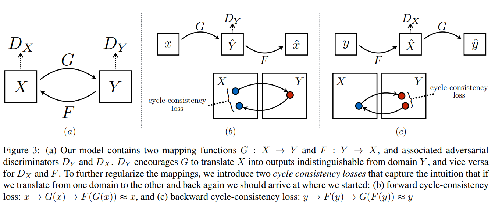
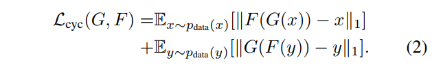
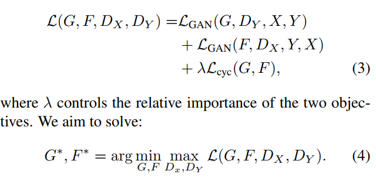

# [Unpaired Image-to-Image Translation using Cycle-Consistent Adversarial Networks](https://junyanz.github.io/CycleGAN/)
Jun-Yan Zhu, Taesung Park, Phillip Isola, Alexei A. Efros

## どんなもの？
データと教師データの一対になっていないデータセット集合からスタイルを学習し、双方向で行き来できるようにしたGAN

## 先行研究と比べてどこがすごい？
セグメンテーションを意識したGANとしては教師データがペアになっていないで学習が出来る点

## 技術や手法の肝はどこ？
一方向の生成モデルである通常のGANでスタイル変換すると入力が違っても同じ出力になる学習破綻が起きやすい。
それを解決するために、一度変換した先からさらに逆変換するGANを同時に学習することで、
通常のGANのlossと入力画像と変換逆変換した画像が近似されているかのlossにより一意性を保とうとする。

## どうやって有効だと検証したか？
* cycle-consistency lossが必要かどうかはablation study
* スタイル変換の定量的評価を行いため、FCNを用い、Segmenationされた教師データから、自然画像を生成し、それをFCNでセグメンテーションすることで、アノテーション結果とどれだけ異なるかを判定する。
* Supervisedのpix2pixとも比較
* UnsupervisedではSoTA

## 議論はある？
* やはりsingle cycleだけではだめ
* スタイル変換ではokだが、幾何変換をしようとするときに失敗する。今後の課題
## 次に読む論文は？
Imageto-image translation with conditional adversarial networks
