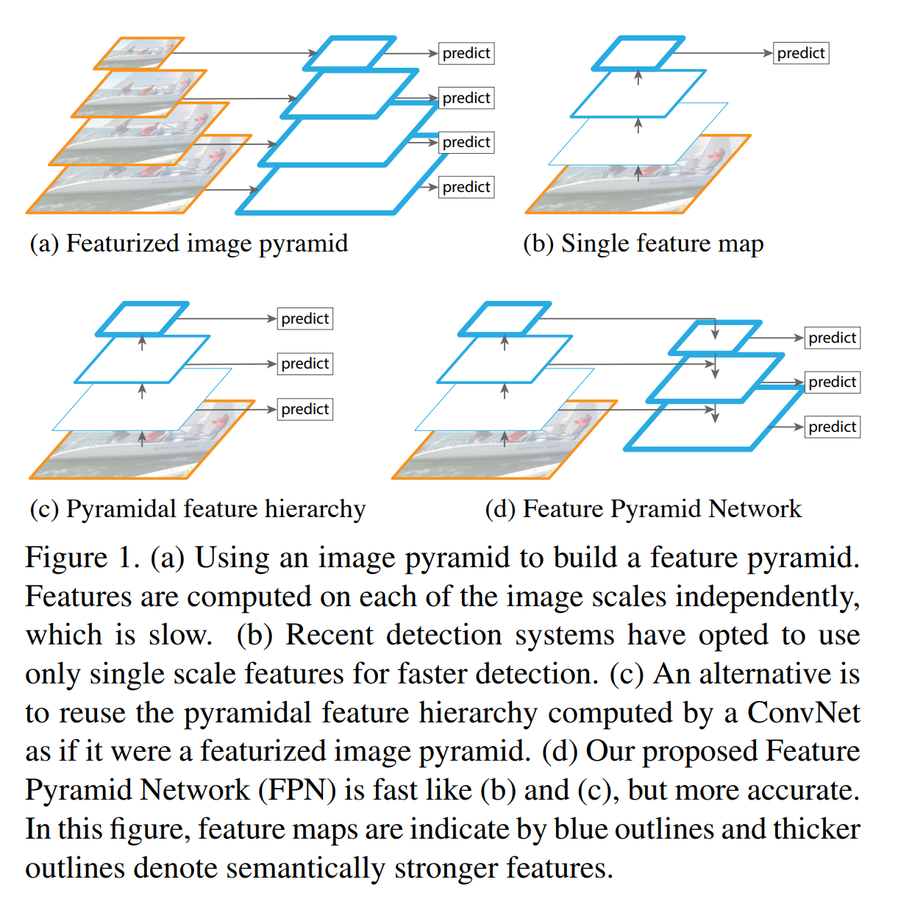
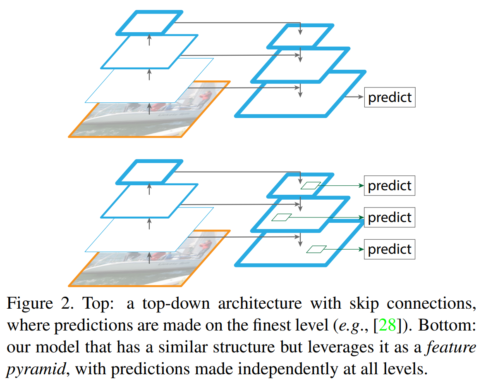
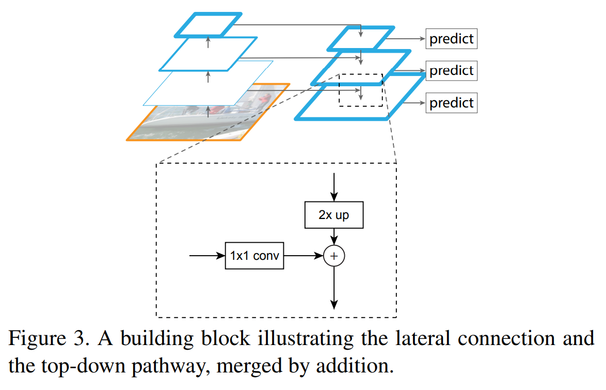

# [Feature Pyramid Networks for Object Detection](https://arxiv.org/pdf/1612.03144.pdf)
Tsung-Yi Lin, Piotr Dollar, Ross Girshick, Kaiming He, Bharath Hariharan and Serge Belongie

## どんなもの？
* 今までの物体検出のアーキテクチャの流れをまとめた。
* 物体検出のために、コンテキストを追加してFaster R-CNNを改造させたモデルで精度向上

## 先行研究と比べてどこがすごい？
画像処理においての今までの物体検出ではaのように画像ピラミッドで構成されているが、
ディープラーニングではb,cが主流。しかし、aは計算量が多く、bは解像度が荒く、cは手前(小さい物体)での推論が荒くなる。

画像ピラミッド向上を意識し、各層で推論することで、コンテキストと解像度を保ちながらの推論を提案

## 技術や手法の肝はどこ？
* 画像ピラミッドを生かしたアーキテクチャ
* 結合モジュールの提案

## どうやって有効だと検証したか？
* COCOデータセットでFaster RCNNを用いたものでSoTA
* ablation studyでrecallが高くなることを示した。

## 議論はある？
画像ピラミッドによりスケール変化に対して強くなったが、まだまだ

## 次に読む論文は？
DSSD : Deconvolutional Single Shot Detector
