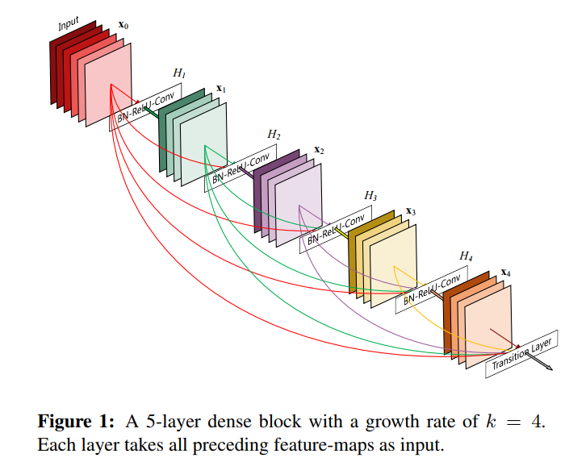
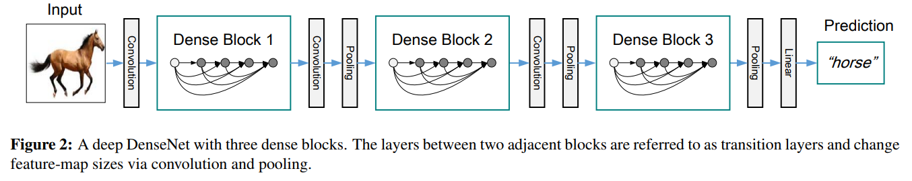
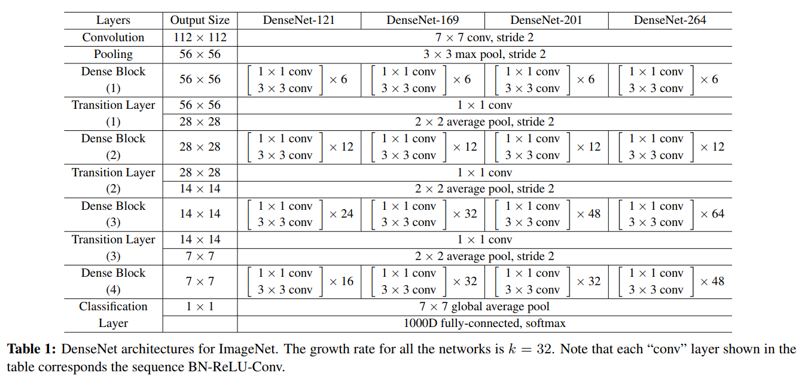
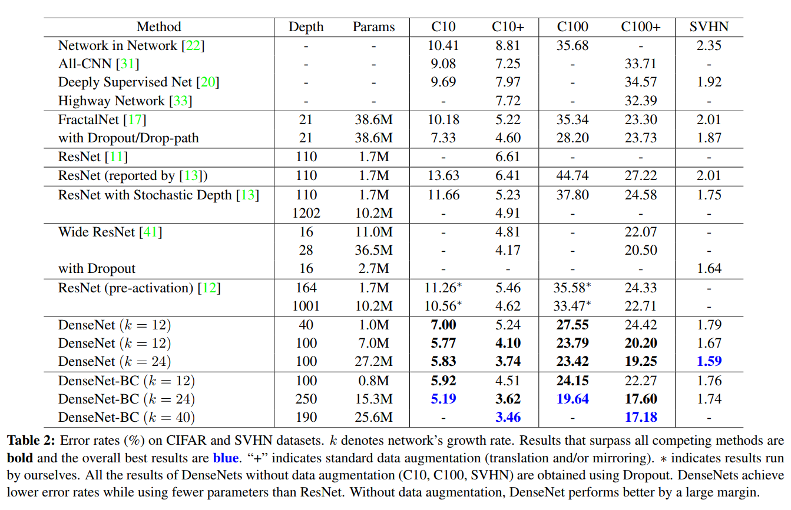
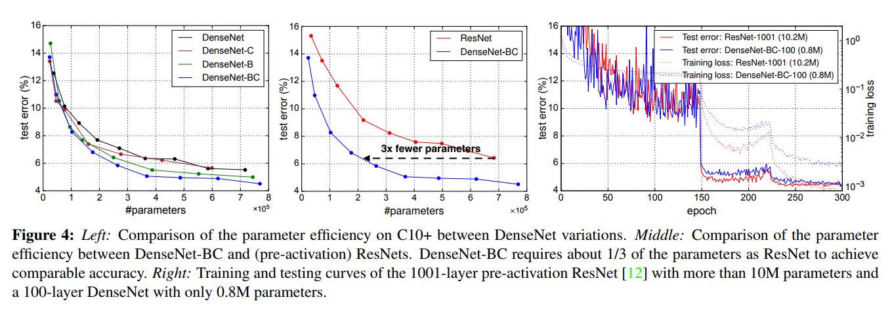
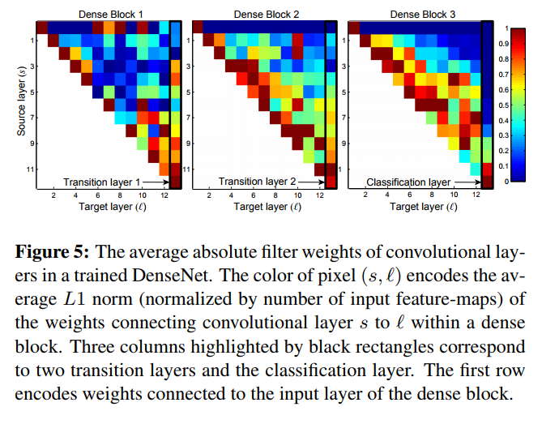

# [Densely Connected Convolutional Networks](https://arxiv.org/abs/1608.06993)
Gao Huang, Zhuang Liu, Laurens van der Maaten

## どんなもの？
物体認識を高精度にするための構造提案．
畳み込んだ後のフィーチャーマップを後段に足しこんでいくことで，
情報を保存しつつ特徴量を保存する．

## 先行研究と比べてどこがすごい？
ネットワーク内の情報を保存し，後段のネットワークが情報を取り扱いやすいようにするdense blockの提案．
認識精度でSoTA

## 技術や手法の肝はどこ？
* 畳み込んだ結果のフィーチャーマップを再利用するという構造
* 無駄なく情報を取り出すため，パラメータ数が少ない

## どうやって有効だと検証したか？
CIFAR10での実験で，エラー率の算出．

## 議論はある？
* モデルに対して，パラメータ数が少ない

## 次に読む論文は？
* Fractalnet: Ultra-deep neural networks without residuals
* On the importance of initialization and momentum in deep learning
* Rethinking the inception architecture for computer vision
* Augmenting supervised neural netowrks with unsupervised objectives for large-scale image classification
