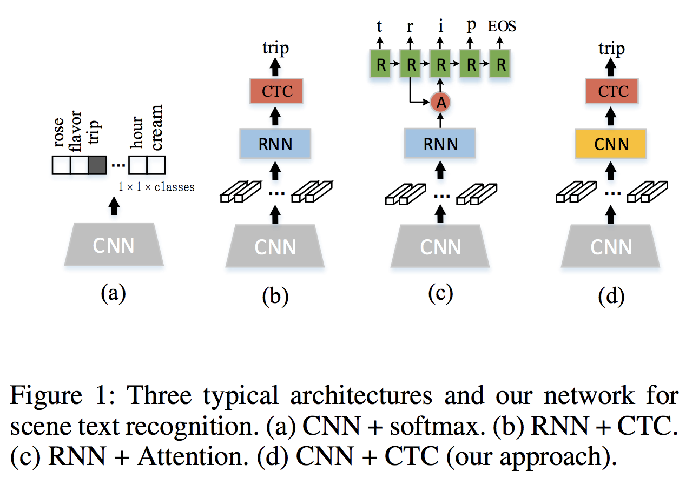
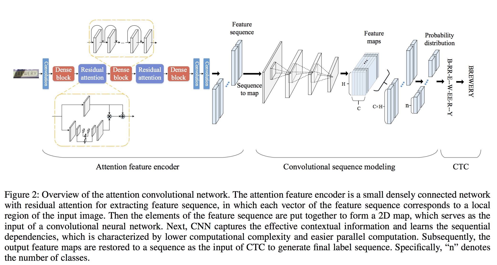

# [Reading Scene Text with Attention Convolutional Sequence Modeling](https://arxiv.org/abs/1709.04303)

Yunze Gao (1 and 2), Yingying Chen (1 and 2), Jinqiao Wang (1 and 2), Hanqing Lu (1 and 2) ((1) National Lab of Pattern Recognition, Institute of Automation, Chinese Academy of Sciences, (2) University of Chinese Academy of Sciences)

## どんなもの？(コントリビューション)
* 既存のCNNを用いたOCR手法での問題点（並列計算不可能）を解消し，学習速度が早くノイズに強いアーキテクチャを提案
* いくつかのデータセットでSOTA

## 先行研究と比べてどこがすごい？
* BLSTMをやめてCNNで並列化可能にしたら，パラメータ数は半分，文字列のモデル化は9倍近く高速化した（性能はほとんど変化なしで）

## 技術や手法の肝はどこ？
* Residual Attenntionによるノイズを抑制し特徴量を抽出するモジュールの提案
* CNNの結果をRNNなしでCTCに突っ込む方法の提案

## どうやって有効だと検証したか？
* Street View Text, IIIT5K, ICDAR2003, ICDAR 2013での比較（SVTではノイズの多いデータセットのためか特に効果あり）

## 議論はある？
* 性能面での向上しているところは少ないので，データセットの傾向と過去のモデルの学習方法について確認し直した方が良さそう．
* CNN sequence modelingはもうちょっと理解必要．

## 次に読むべき論文は？
* Word spotting and recognition with embedded atributions.
* End-to-end text recognition with hybrid hmm maxout models
* Learning long-term dependencies with gradient descent is difficult
* Reading text in uncontrolled conditions.
* Language modeling with gated convolutional networks
* Convolutional sequence to sequence learning
* Visual attention models for scene text recognition
* Whole is greater than sum of parts
* Supervised mid-level features for word image representation
* Deep speech: Scaling up end-to-end speech recognition
* Deep structured output learning for unconstrained text recognition
* Synthetic data and artificial neural networks for natural scene text recognition
* Reading text in the wild with convolutional neural networks
* Deep features for text spotting
* Exploring the limits of language modeling
* Recursive recurrent nets with attention modeling for ocr in the wild
* Addressing the rare word problem in neural machine translation
* Deep maxout networks for low-resource speech recognition
* Scene text recognition using higher order language priors
* Top-down and bottom-up cues for scene text recognition
* Label embedding: A frugal baseline for text recognition
* An end-to-end trainable neural network for image-based sequence recognition and its application to scene text recognition
* Scene text recognition using part-based tree-structured charactor detection
* Robust scene text recognition with automatic rectification
* Fast and accurate sequence labeling with iterated dilated convolutions
* End-to-end scene text recognition
* Accurate scene text recognition based on recurrent neural network
* End-to-end text recognition with convolutional neural networks
* Residual attention network for image classification
