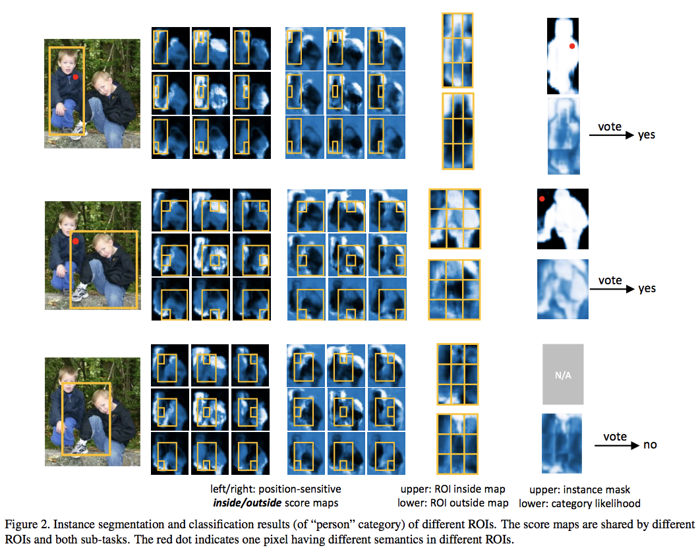
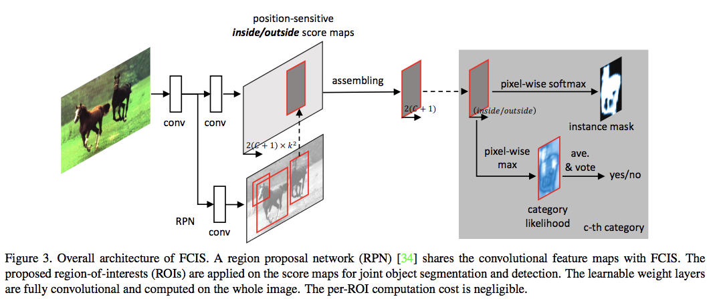
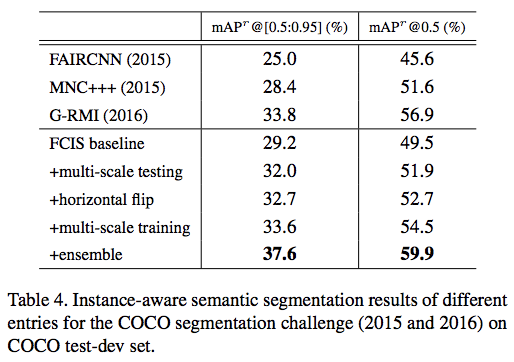
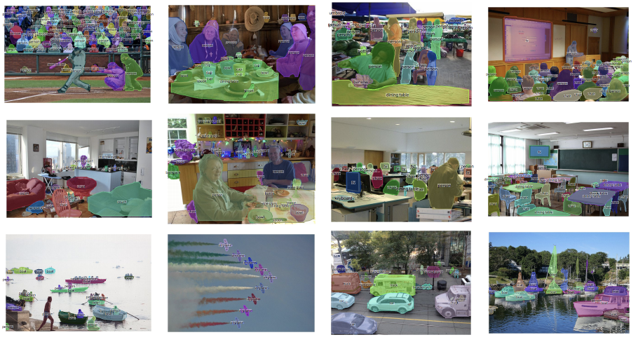

# [Fully Convolutional Instance-aware Semantic Segmentation](https://arxiv.org/abs/1611.07709)
Yi Li, Haozhi Qi, Jifeng Dai, Xiangyang Ji, Yichen Wei

Microsoft Research Asia

## どんなもの？(コントリビューション)
* COCO 2016 Instance Segmentationで1位を勝ち取った手法
* RFCNのPositive-sensitiveマップと物体検出手法を組み合わせたようなアーキテクチャを提案

## 先行研究と比べてどこがすごい？
* Baselineの段階でMNC+++（Coco 2015）の結果を上回る．
* 従来手法の問題点として，セグメンテーションと検出をそれぞれ行って統合していたが，この方法では二つの手法の相関的な情報をうまく活用出来ない点について解説．

## 技術や手法の肝はどこ？
* 上記の問題を解消する方法としてPositive-Sensitive Score Mapsを導入．
* ROIにおいて，セグメンテーションのInsideとOutsideを計算し，同じピクセルが別のROIで違う意味を持つことが出来るようにした点

## どうやって有効だと検証したか？
* PASCAL VOCで提案手法自体のアブレーションスタディを実験（Positive Sensitiveの有効性を示す．）
* COCOデータセットで既存手法及びモデルのアーキテクチャ以外での手法のアブレーションスタディ（OHEMなど）

## 議論はある？
* 後で

## 次に読むべき論文は？
* Semantic image segmentation with task-specific edge detection using cnns and a discriminatively trained domain transoform
* Semantic image segmentation with deep convolutional nets and fully connected crfs
* Instance-aware semantic segmentation via multi-task network cascades
* Learning to segment object candidates
* Learning to refine object segments
