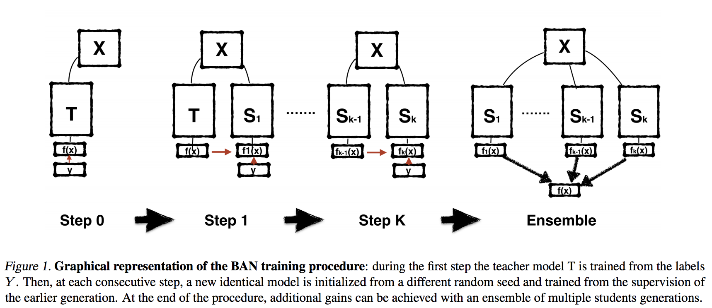
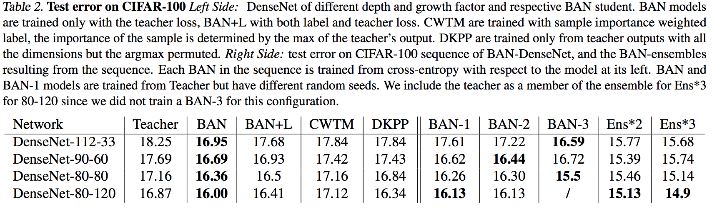

# [Born Again Neural Networks](https://arxiv.org/abs/1805.04770)
Tommaso Furlanello, Zachary C. Lipton, Michael Tschannen, Laurent Itti, Anima Anandkumar

University of Southern California, CMU, Amazon AI, Caltech, ETH Zurich

## どんなもの？(コントリビューション)
* Knowledge Distilationは精度の高い大きいモデルから小さいモデルに知識を移すことを目的としていることが多いが，これは同じ構造間でモデルの性能向上を計ったもの．

## 先行研究と比べてどこがすごい？
* 一般的な学習の勾配と蒸留による勾配の比較により，蒸留で何故学習していけるのかの考察が出た．
* 単一の上流ではなく，複数世代のアンサンブルで蒸留した場合に多くのケースで精度向上を達成している．

## 技術や手法の肝はどこ？
* KD（Knowledge Distilation）はカテゴリ間の類似度を学習しているという考察より，KDは正解ラベルの信頼度に対する重要度を重み付けしているのではないかという仮説
* 逐次的な知識蒸留によるk番目のモデルを学習し，複数世代の予測平均化によるアンサンブル学習

## どうやって有効だと検証したか？
* CNNによる画像認識とPTBデータセッとを用いた言語モデルにおいても検証．
* 全てにおいてKDが精度向上するわけではないが，複数世代のアンサンブルは効果がある．

## 議論はある？
* データセットの難易度により異なるのではないか

## 次に読むべき論文は？
* Distilling the knowledge in a neural network
* Do deep nets really need to be deep?
* Do deep convolutional nets really need to be deep and convolutional?
* Policy distillation
* Distilling a neural network into a soft decision tree
* The mythos of model interpretability
* Shake-shake regularization
* ShakeDrop regularization
*  Deep pyramidal residual networks with separated stochastic depth.