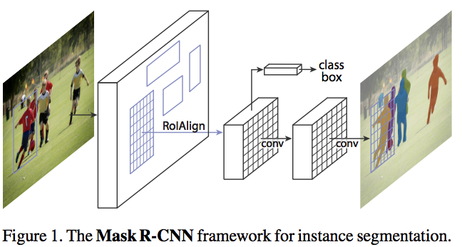

# [Mask R-CNN](https://arxiv.org/abs/1703.06870)
Kaiming He, Georgia Gkioxari, Piotr Dollár, Ross Girshick

Facebook AI Research (FAIR)

## どんなもの？(コントリビューション)
* Instance SegmentationでCOCO2016の1位含め，SoTA
* Instance Segmentation含め，検出，姿勢推定を同時に行うことで精度向上

## 先行研究と比べてどこがすごい？
* 結果としてSoTA
* FCIS（COCO 2016 winner)ではインスタンスが重なる時，変なエッジが発生してしまう問題を解消

## 技術や手法の肝はどこ？
* Faster R-CNNをベースに構築，RoIPoolingではなく，RoIAlignを導入．
* RoIPoolingでは解像度の荒い特徴マップから推定された予測座標位置で抜く際，近くのピクセル？に近似して値を取って来ていたが，これはセグメンテーションには影響が大きい．
* RoIAlignは推定位置から抜く際値を周辺値から補間することで情報を失わず抜くことができる．

## どうやって有効だと検証したか？
* COCO 2016データセット
* 姿勢推定，物体検出含め

## 議論はある？
* MTLにより姿勢推定，セグメンテーション，検出は精度上がるが，どのタスクがMTLで精度あがるのか．MTLの関連性はどこまで大丈夫か

## 次に読むべき論文は？
*  S. Ren, K. He, R. Girshick, and J. Sun. Faster R-CNN: Towards real-time object detection with region proposal networks. In TPAMI, 2017
