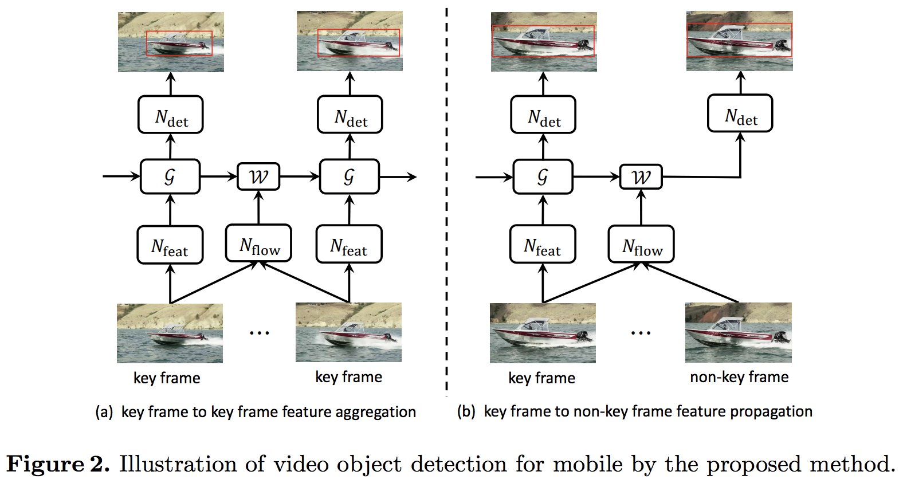
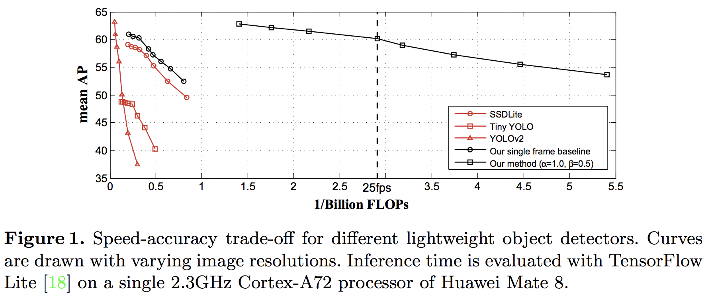
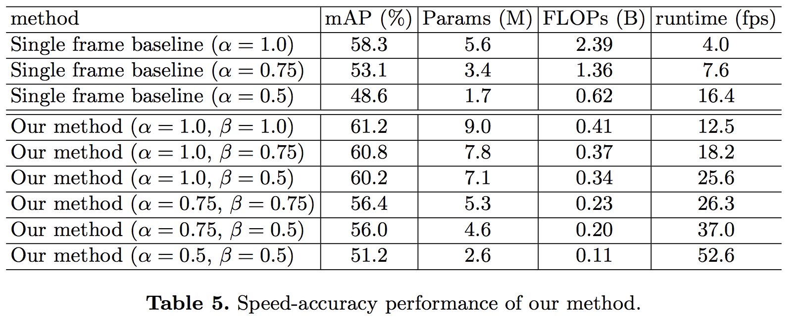

# [Towards High Performance Video Object Detection for Mobiles](https://github.com/Swall0w/papers/issues/649)
Xizhou Zhu, Jifeng Dai, Xingchi Zhu, Yichen Wei, Lu Yuan

Microsoft Research Asia

## どんなもの？(コントリビューション)
* 動画物体検出で処理が重いが有効とされている手法をモバイルでも動くように各モジュールを軽量化した．
* a single 2.3GHz Cortex-A72 processor of Huawei Mate 8上で評価され，最速52.6FPS達成

## 先行研究と比べてどこがすごい？
* モバイル動画検出器の手法でしっかり評価が比較評価を行われてる初めての研究．
* モデルの徹底的な軽量化

## 技術や手法の肝はどこ？
* 動画での検出手法は以前提案された間隔的な特徴量抽出器とその間をOpticalFlowを用いて計算し，補間する手法の各モデルを軽量化し，高速化した．
* feature aggregation（周辺から特徴量を集約）
* Light Flow（FlowNetをベースに軽量化，精度はその分落ちている）
* Lightweight Key-frame Object Detector（MobileNet + Light-Head R-CNN）

## どうやって有効だと検証したか？
* Light Flowのアブレーションスタディ
* feature aggregationのアブレーションスタディ

## 議論はある？
* ここまでモデルを軽量化しているのになぜモデル圧縮自体はしないのか
* サンプリング間隔が長い時，例えば激しいブレなどはどの程度影響があるのか

## 次に読むべき論文は？
* Tiniy SSD: A tiny single-shot detection deep convolutional neural network for real-time embedded object detection
* Toward high performance video object detection
* Rigid-motion scattering for image classification
* Deconvolution and checkerboard artifacts.
* Delving deeper into convolutional networks for learning video representations
* Mobile video object detection with temporally-aware feature maps.
* Videolstm convolves, attends and flows for action recognition.
* T-CNN: Tubelets with convolutional neural networks for object detection from videos.
* Multi-class multi-object tracking using changing point detection
* Inverted residuals and linear bottlenecks: Mobile networks for classification, detection and segmentation.
* Fast yolo: A fast you only look once system for real-time embedded object detection in video.
