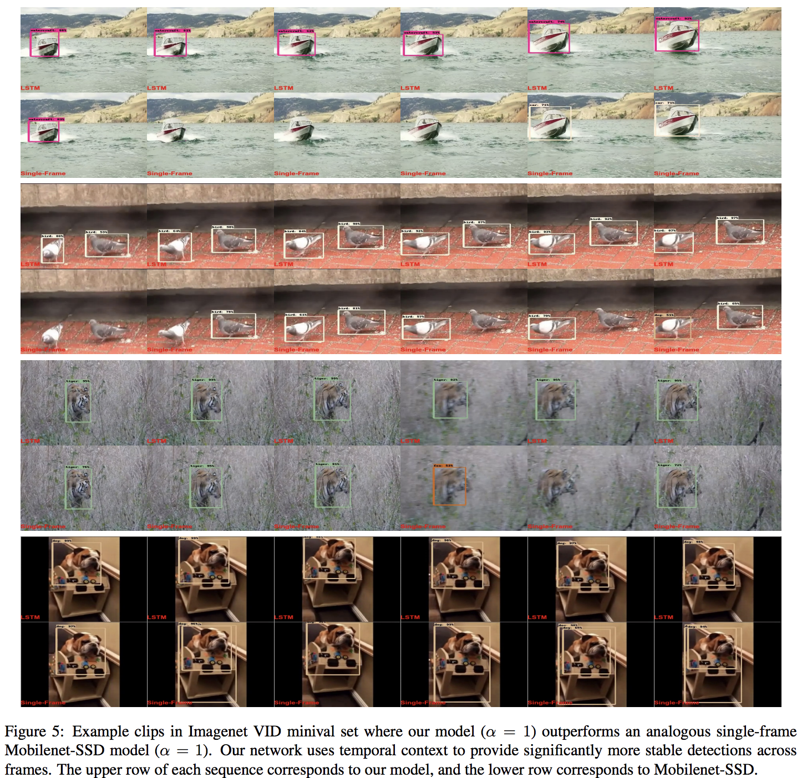

# [Mobile Video Object Detection with Temporally-Aware Feature Maps](https://arxiv.org/abs/1711.06368)
Mason Liu, Menglong Zhu

Georgia Tech, Google

## どんなもの？(コントリビューション)
* Mobileでの動画検出手法を提案．
* モバイル上で確認したものとしては初

## 先行研究と比べてどこがすごい？
* モバイル上の動画検出に向けてフレームワークとして提案
* ConvLSTMをどの段階に導入すると効果的かの検証

## 技術や手法の肝はどこ？
* ConvLSTMを用いて特徴量抽出の段階で時系列データを取り扱う．
* 計算量削減のため，Bottleneck ConvLSTMを提案

## どうやって有効だと検証したか？
* ImageNet VID datasetでの比較検証

## 議論はある？
* モバイルの評価方法が機種によって速度が異なってしまうため，定量的な評価にならないのではないか？

## 次に読むべき論文は？
* MobileNets: Efficient Convolutional Neural Networks for Mobile Vision Applications
