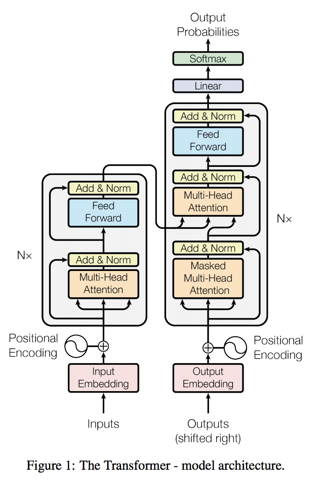
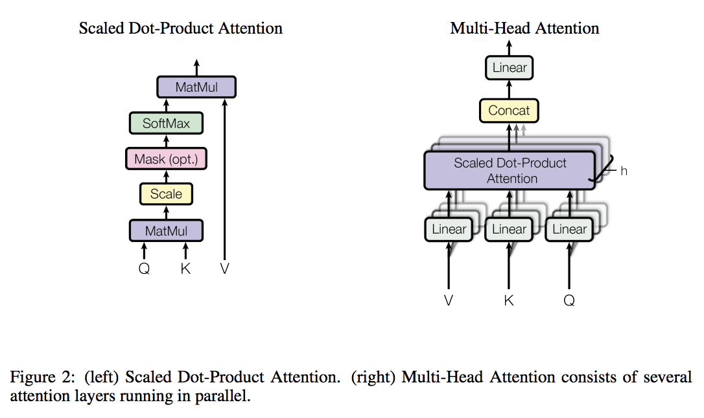
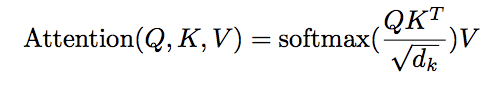
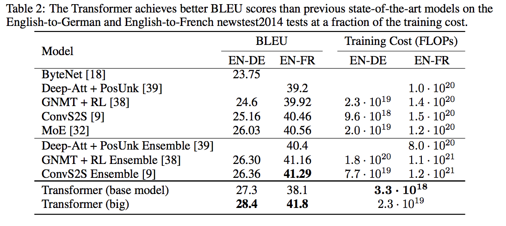

# [Attention Is All You Need](https://arxiv.org/abs/1706.03762)
Ashish Vaswani, Noam Shazeer, Niki Parmar, Jakob Uszkoreit, Llion Jones, Aidan N. Gomez, Lukasz Kaiser, Illia Polosukhin

Google Brain, Google Research, University of Toronto

## どんなもの？(コントリビューション)
* 時系列データ処理のモデルとして，Attentionを採用した．
* RNNだと難しい，並列化と文章が長いと計算時間が長くなる問題を解決．

## 先行研究と比べてどこがすごい？
* RNNやConvolutionを使用せずに時系列問題を解く．
* WMT 2014タスクでSoTA
* RNNでは難しかったタスクのモデル転移学習を検証

## 技術や手法の肝はどこ？
* Encoder, Decoder共にAttention機構を使用．並列化のため，Multi-Head Attentionを採用．
* Attentionは内積を用い，機構自体を辞書，Key-Valueであると解釈している．
* 次元が大きくなると，Softmax内の内積が大きくなり，勾配が小さくなるため，Attentionが弱いことが確認された．そのため，次元の平方で割っている．

## どうやって有効だと検証したか？
* WMT 2014タスクでEnglish-German, English-Frenchで検証

## 議論はある？
* 並列化に関して，どこまで並列化可能なのか

## 次に読むべき論文は？
* Long short-term memory-networks for machine reading
* Deep learning with depth wise separable convolutions
* Empirical evaluation of gated recurrent neural networks on sequence modeling
* Convolutional sequence to sequence learning
* Gradient flow in recurrent nets: the difficulty of learning long-term dependencies
* Long Short-term memory
* A strutted self-attentive sentence embedding
* A deep reinforced model for abstractive summarization
* Google's neural machine translation system: Bridging the gap between human and machine translation
