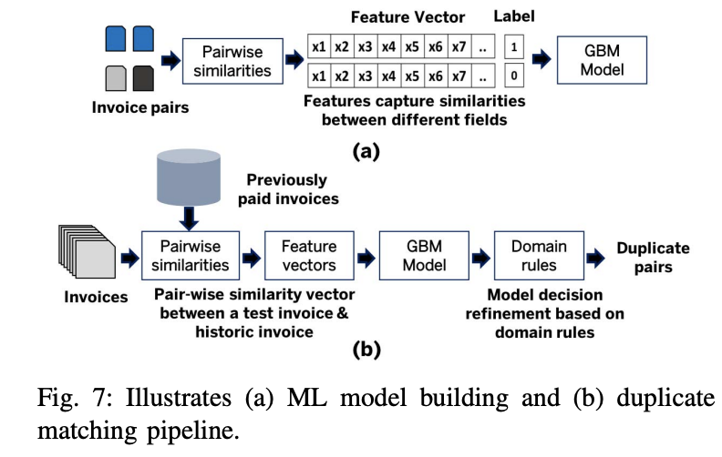
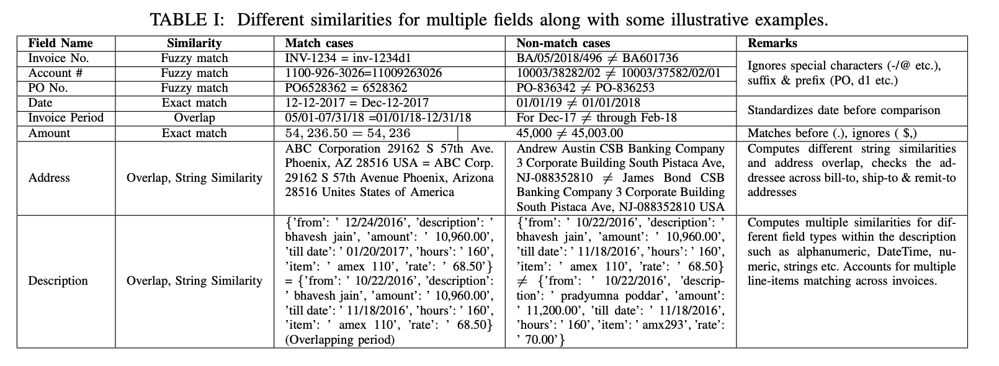

# [Digital Auditor: A Framework for Matching Duplicate Invoices](None)
Himanshu S. Bhatt, Shourya Roy, Lokesh Bhatnagar, Chetan Lohani, Vinit Jain

American Express

## どんなもの？(コントリビューション)
* 請求書の重複検出システム提案

## 先行研究と比べてどこがすごい？
* レイアウト＆状態（スキャン，PDF）によらない情報抽出手法の提案
* Fuzzy Matchingによる重複検出モジュールの提案（請求書面での適用は初めて）

## 技術や手法の肝はどこ？
* フレームワークとしての一連の流れの提案
* Fuzzy Matchingによるここの類似度の出し方の検討
* MLによる検出とルールベースの組み合わせ

## どうやって有効だと検証したか？
* 自社内の80000万請求書を用いて，検証
* ERPのメタデータによる重複検出よりhit率を70%近く上げ，人手による作業を78%減少させた．

## 議論はある？
* ドメインにおけるルールベースの手法が記載されていない．
* 漏れについてはどのような例があるのか？

## 次に読むべき論文は？
なし
