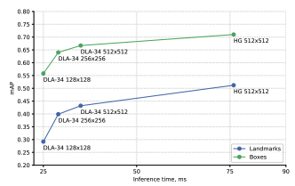
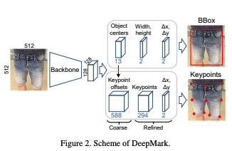
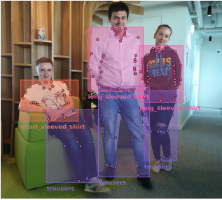

# [DeepMark: One-Shot Clothing Detection](https://arxiv.org/abs/1910.01225)
Alexey Sidnev, Alexey Trushkov, Maxim Kazakov, Ivan Korolev, Vladislav Sorokin

Huawei Research Center, Lobachevsky State University of Nizhny Novgorod

## どんなもの？(コントリビューション)
* 服の検出において，ワンショット（ワンステージ）でバウンディングボックスとKeyPointsを推定する手法を提案．
* DeepFashion2でSoTA達成
* モバイル用に向けて速度精度のトレードオフを検証

## 先行研究と比べてどこがすごい？
* CenterNetで服装検出を行うためにKeyPoints用に変更
* KeyPoints検出でマルチクラスの検証は初めて

## 技術や手法の肝はどこ？
* 一旦荒いKeypointsを推定後，改善する仕組みにより精度向上
* 精度を上げるために後処理方法を工夫
* 同じ重みで画像を反転させて推定し，戻してNMSやマルチスケールで推定した後に後し処理．（2mAPほど向上）

## どうやって有効だと検証したか？
* DeepFashion2にてablation study

## 議論はある？
* モバイル向けにおいては速度比較だけでなく，メモリも検証した方がいいのでは？

## 次に読むべき論文は？
* Bottom-up object detection by grouping extreme and center points.
