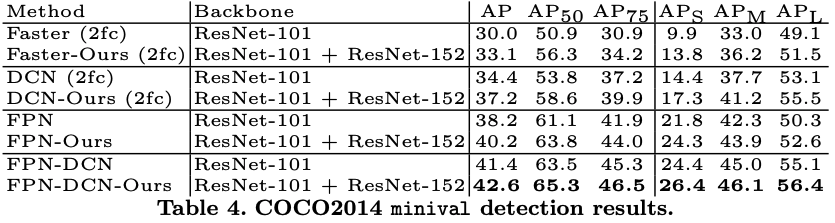

# [Revisiting RCNN: On Awakening the Classification Power of Faster RCNN](http://openaccess.thecvf.com/content_ECCV_2018/papers/Bowen_Cheng_Revisiting_RCNN_On_ECCV_2018_paper.pdf)
Bowen Cheng, Yunchao Wei, Honghui Shi, Rogerio Feris, Jinjun Xiong, and Thomas Huang

University of Illinois at Urbana-Champaign, IBM T.J. Watson Research Center

## どんなもの？(コントリビューション)
* Faster RCNNでFalse Positiveが起きる原因について分析し，FPを減らす手法を提案．
FPが起きる原因は3つ
* 分類と座標位置推定の共用パラメータは両方のパラメータにとっての最適解になるわけではない．
* マルチタスクラーニングは最適化を助けるが，準最適解にハマるため，個々の損失値よりも大きい値になる．
* スケールが大きいため，余分な領域が分類の時に入る

## 先行研究と比べてどこがすごい？
* FPについて分類し，なぜそれが起きるのか，対策手法を提案しているところ．

## 技術や手法の肝はどこ？
* 分離した分類器及び分離した最適化方法の提案．

## どうやって有効だと検証したか？
* Pascal VOC2012, COCO2014で検証
* ネットワーク（Deformable Conv）を変更し，どのアーキテクチャでも精度が上がることを検証

## 議論はある？
* シンプルで既存のモデルに組み込むことは可能だが，学習と持ち運び性が落ちるため，アイディア自体そのままで他の実装にすることは出来ないか？Decoupled Optimizationが困難では？

## 次に読むべき論文は？
* なし
