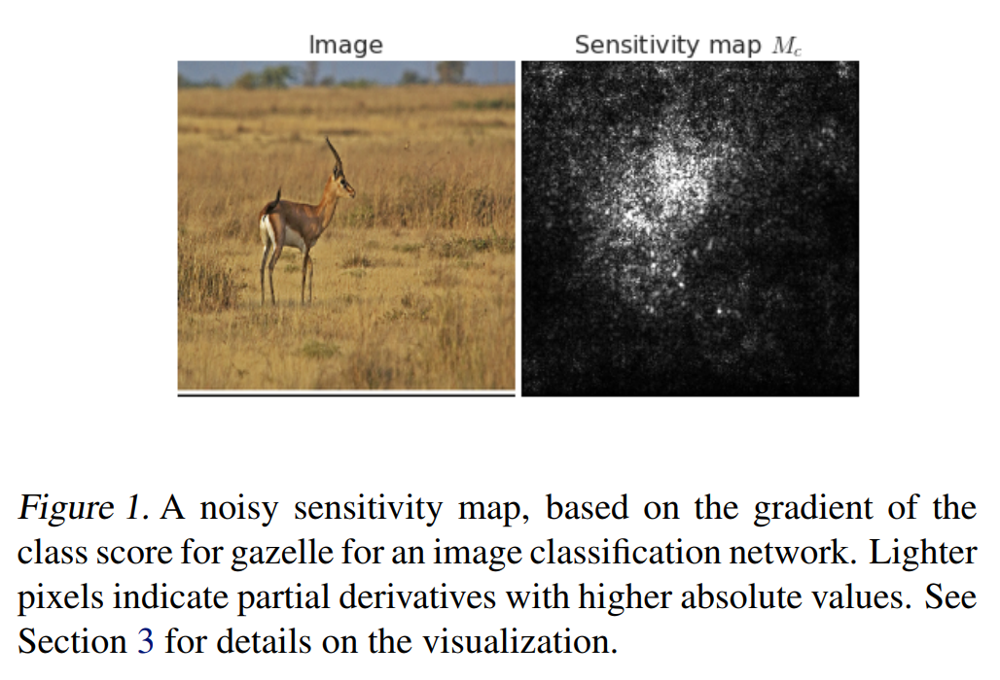
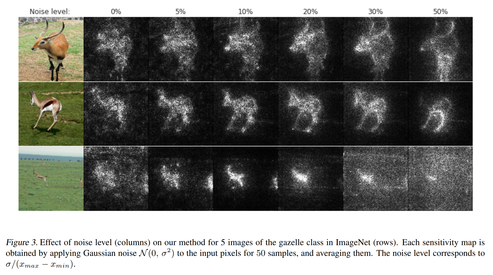

# [SmoothGrad: removing noise by adding noise](https://arxiv.org/abs/1706.03825)
Daniel Smilkov, Nikhil Thorat, Been Kim, Fernanda Viégas, Martin Wattenberg
## どんなもの？
画像認識で識別器がどこに注目したのかを可視化。

## 先行研究と比べてどこがすごい？
CNNで損失関数の勾配をバックプロップで入力画像まで伝搬し、
その絶対値の強度を可視化する手法ではノイズ多かったがSmoothGradは入力画像にガウシアンノイズを与え、
複数の勾配を平均することで綺麗に可視化できる。

## 技術や手法の肝はどこ？
* 入力画像にガウシアンノイズを追加し、勾配を平均化
* 学習時にもガウシアンノイズを追加することで、可視化が綺麗になる。

## どうやって有効だと検証したか？
定量的な評価方法が定められていないため、定性的評価

## 議論はある？
* ノイズの原因は局所的な意味のない勾配によるものではないかという仮説
* 仮説の数式的解明に期待
* 学習時に部分的な微分の罰則をすることで、よりきれいな可視化が出来ないだろうか？

## 次に読む論文は？
Rethinking the Inception Architecture for Computer Vision
